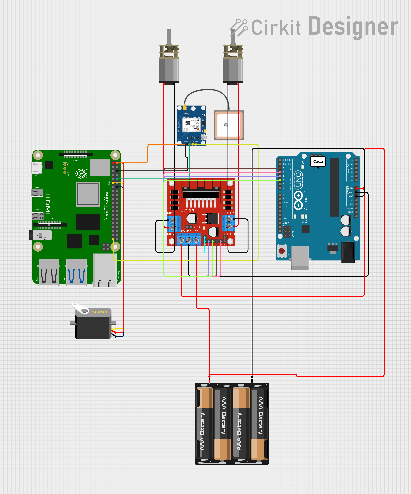
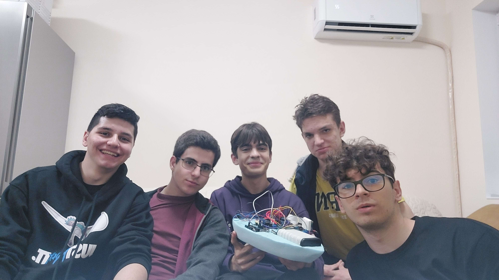

# AquaSense
## Проект за HackTues24 

AquaSense е универсална система за сензори, създадена с цел да оценява качеството на водата и да открива замърсявания. Тя комбинира различни технологии, за да предостави комплексни възможности за мониторинг, включително измерване на нивата на pH, разпознаване на боклуци с помощта на OpenCV и идентификация на нефтопродукти чрез UV облъчване. AquaSense е подходяща за използване в различни водни обекти като басейни, лодки и резервоари.

## Използвани технологии

- **Eclipse Dirigible**: Използван за облачно разположение и управление на бази данни.
- **Leaflet.js**: Използван за разработване на backend.
- **Raspberry Pi**: Служи като основен компонент, оборудван с камера на Raspberry Pi за разпознаване на боклуци.
- **Arduino Uno**: Използва се за четене на pH сензори и откриване на нефтопродукти като дизел или масло.
- **OpenCV**: Трениран модел за разпознаване на боклуци.
- **ChatGPT**: Използван за генериране на текст въз основа на събраните данни.

## Функционалности

- **Измерване на ниво на pH**: AquaSense е способна да измерва нивата на pH във водни обекти с точност.
- **Разпознаване на боклуци**: Чрез използване на OpenCV, AquaSense може да идентифицира и категоризира различни видове боклуци, присъстващи във водата.
- **Откриване на нефтопродукти**: Чрез използване на UV облъчване, системата може да открива нефтопродукти, предоставяйки информация за потенциални замърсявания.
- **Разнообразно разположение**: AquaSense може да бъде инсталирана на различни повърхности, които са в контакт с водата, включително лодки, плувни съдове и други плавателни средства.

## Инсталация

1. **Настройка на Raspberry Pi**: Инсталирайте необходимите зависимости и свържете камерата на Raspberry Pi.
2. **Инсталиране на Arduino Uno**: Свържете pH сензора и сензора за откриване на нефтопродукти към Arduino Uno.
3. **Инсталиране на Eclipse Dirigible**: Настройте облачна среда чрез [докер](https://www.dirigible.io/help/setup/docker/) за съхранение и управление на данни. В него се клонира [моментното](https://github.com/Ne-Se-Chete/hacktues2024) репозитори
4. **Leaflet.js Backend**: Leaflet.js има прототип за работа в папка *leaflet/*. Той бива интегриран в дирижабъка като extension.
5. **Конфигурация на OpenCV**: Настройте и конфигурирайте OpenCV за разпознаване на боклуци.

## Използване

1. **Разположете AquaSense**: Инсталирайте AquaSense на желаната повърхност, която е в контакт с водния обект.
2. **Събиране на данни**: Разрешете на AquaSense да събира данни относно нивата на pH, присъствието на боклуци и откриването на нефтопродукти.
3. **Анализ на данни**: Анализирайте събраните данни чрез облачната среда на Eclipse Dirigible.
4. **Мониторинг**: Непрекъснато мониторирайте качеството на водата и нивата на замърсяване, използвайки информацията, предоставена от AquaSense.

## Схеми

## Приноси

Приносите за AquaSense са добре дошли! Не се колебайте да клонирате хранилището, да правите промени и да изпращате pull заявки. За големи промени, моля, отворете съответното issue, за да обсъдим предложените промени.

## Лиценз

Този проект е лицензиран под  [MIT License](LICENSE).

## Благодарности

- Благодарности на разработчиците и приносителите на Eclipse Dirigible, Leaflet.js, Raspberry Pi, Arduino Uno, OpenCV и ChatGPT за техните ценни технологии и ресурси, използвани в този проект.

## Нашият отбор

